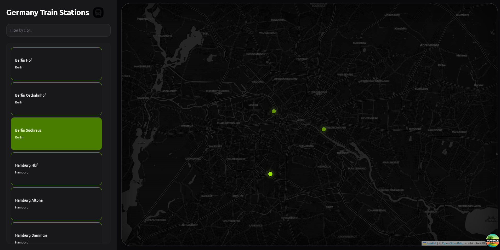

# 🚄 German Train Stations Map

A modern, responsive frontend application visualizing German train stations on an interactive map. Built for the PANTOhealth technical assessment.

 ## 🚀 Live Demo
[**View Deployed App**](YOUR_VERCEL_LINK_HERE)

## 🛠 Tech Stack
* **Framework:** React 18 + Vite
* **Language:** TypeScript
* **State Management:** URL-based state (TanStack Router)
* **Maps:** Leaflet + React Leaflet
* **Styling:** Tailwind CSS + Shadcn/ui (Radix Primitives)
* **Validation:** Zod
* **Testing:** Vitest + React Testing Library

## ✨ Features
* **Interactive Map:** View all stations with custom markers.
* **City Filtering:** Real-time filtering updates both the list and the map.
* **URL Synchronization:** Filter state and selected stations are stored in the URL, making views shareable and bookmarkable.
* **Responsive Design:** Features a collapsible bottom drawer for mobile users and a sidebar for desktop users.
* **Data Validation:** Adapts external API data to internal TypeScript models for safety.

## 🏗 Architecture Decisions

### 1. URL as State Source of Truth
Instead of using `useState` or `Redux` for the active filter, I utilized **URL Search Parameters**.
* **Why?** It enables deep linking. A user can share a URL like `/?city=Berlin&stationId=1`, and the recipient sees the exact same view.
* **How?** Used `TanStack Router` with `Zod` validation to ensure URL params are type-safe.

### 2. Custom Hooks for Logic Separation
I separated the view layer from the business logic using the `useStationDashboard` hook.
* **Why?** This keeps components clean (Presentational) and makes logic easier to test in isolation.

### 3. Mobile-First Layout
The UI adapts heavily between devices:
* **Desktop:** Standard Sidebar + Map layout.
* **Mobile:** Map becomes the background; the sidebar transforms into an expandable bottom drawer to maximize screen real estate.

## 🏃‍♂️ Getting Started

1.  **Install Dependencies**
    ```bash
    pnpm install
    ```

2.  **Run Development Server**
    ```bash
    pnpm dev
    ```

3.  **Run Tests**
    ```bash
    pnpm test
    ```

## ✅ Testing
Unit tests are included for the core business logic hook using **Vitest**.
* Verifies initial data loading.
* Verifies that filter actions trigger navigation events.

---
*Created by [Your Name]*
